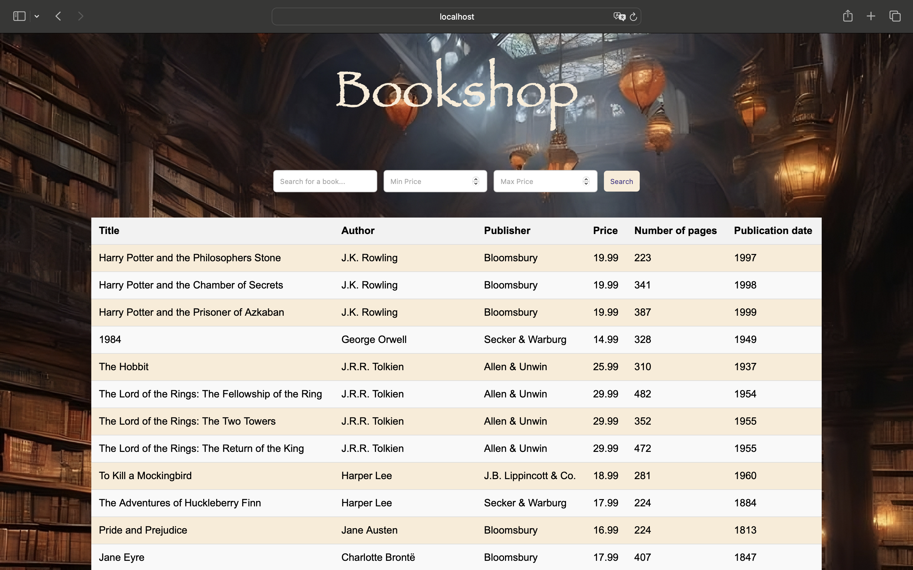

# BookshopWebApp

This project was realized during **Distributed programming technologies** course in Polish-Japanese Academy of Information Technology.

BookshopWebApp is a web-based Java application that allows users to search and filter books from a database.
The application utilizes Java Servlets and JSP to handle requests and display results dynamically. Users can search for books by title and filter them by price range.

## Features
- Search for books by title or author.
- Filter books based on a minimum and maximum price.
- View detailed information about books, including title, author, publisher, price, number of pages, and publication date.
- A user-friendly web interface.

## Technologies Used
- Java (Servlets, JSP)
- Jakarta EE
- HTML/CSS for frontend design
- Tomcat
- JDBC (for database connection)
